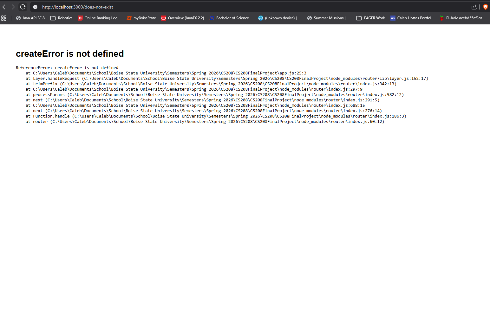
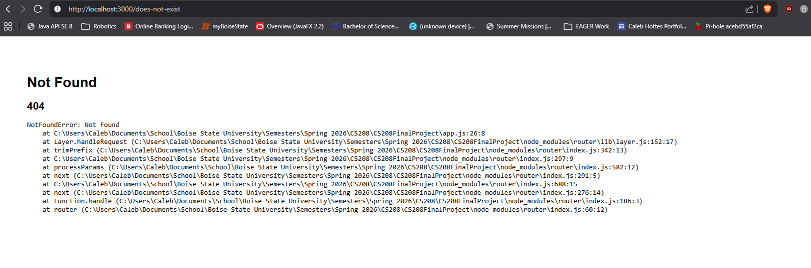

# Bug Report: 404 Handler Throws `ReferenceError`

## Summary

Requests to an unknown route do not render the intended 404 error page. Instead,
the application throws a `ReferenceError` because `createError` is used in
`app.js` but never imported.

## Severity

Medium

## Affected File

- `app.js`

## Environment

- Node.js / Express application
- Current repository state as of April 22, 2026

## Steps to Reproduce

1. Start the application with `npm start`.
2. Open the app in a browser.
3. Navigate to a route that does not exist, such as `/does-not-exist`.

## Expected Result

The app should create a 404 error and render the `error.pug` view with a 404
status.

## Actual Result

The request hits the 404 middleware, but the app throws a `ReferenceError`
because `createError` is not defined as shown. 


## Likely Root Cause

In `app.js`, the 404 handler calls:

```js
next(createError(404));
```

However, the module is never imported at the top of the file. The app appears
to expect:

```js
const createError = require('http-errors');
```

## Impact

- Any request to a missing route fails incorrectly.
- The user gets an internal server error behavior instead of a clean 404 page.
- This makes error handling look broken even though `error.pug` exists.

## Recommended Fix

Add the missing import to `app.js`:

```js
const createError = require('http-errors');
```

This should be placed near the other `require(...)` statements at the top of the
file.
After implementing this we see


## Notes

- The dependency already exists in `package.json`, so no package installation is
  needed.
- After the fix, test a nonexistent route again to confirm the app returns a
  proper 404 response.
